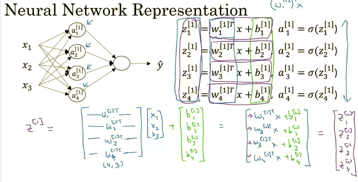
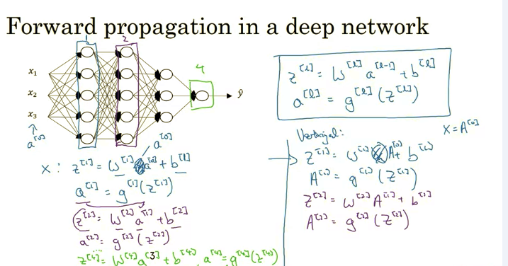
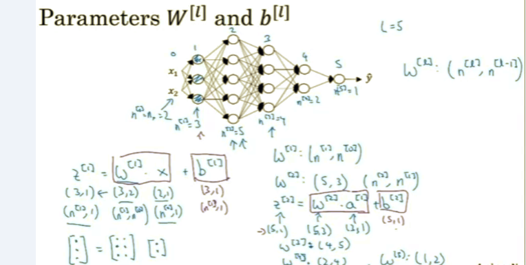

# DeepLearning_Specialization
Deep Learning Specialization (Intermediate level): 1- Neural Networks and Deep Learning, 2 - Hyperparameter Tuning, Regularization and Optimization, 3- End-to-end project , 4-Convolutional Neural Networks, 5- Natural Language Processing (Sequence models)

